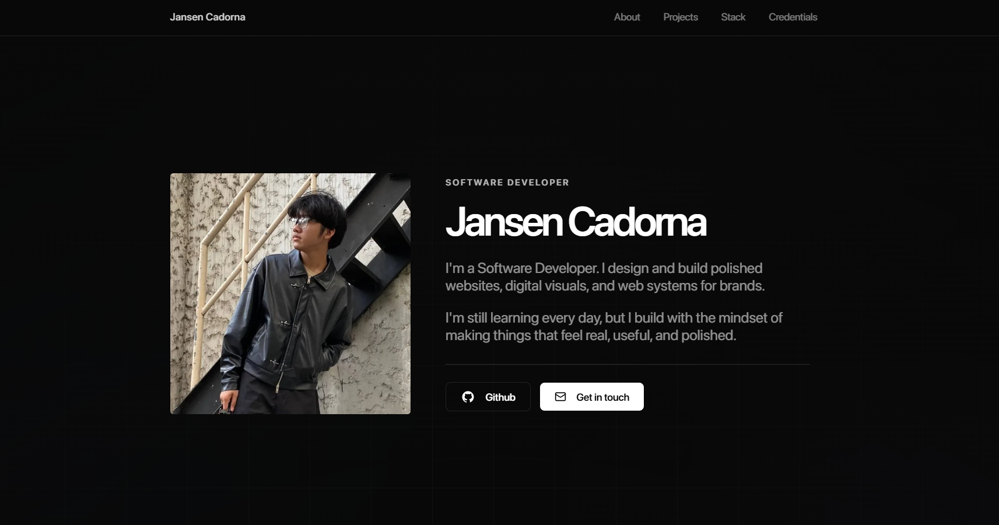

# Jansen Cadorna — Portfolio V2

<div align="center">
  
</div>

<br />

<div align="center">
  <strong>Premium dark developer portfolio built with Next.js, TypeScript, Tailwind CSS, shadcn/ui, Motion, Vercel Analytics, and SEO optimization.</strong>
</div>

<br />

<div align="center">
  <a href="https://www.jansencadorna.com"><strong>Live Website</strong></a>
  ·
  <a href="https://github.com/cadornajansen"><strong>GitHub</strong></a>
  ·
  <a href="mailto:hello@jansencadorna.com"><strong>Contact</strong></a>
</div>

<br />

<div align="center">


</div>

---

## Overview

**Portfolio V2** is a premium dark personal portfolio created to present my projects, technical stack, certifications, and software development direction through a clean and product-focused web experience.

The goal of this portfolio is not only to display information, but to make the site feel like a polished digital product: fast, intentional, responsive, SEO-ready, and visually memorable.

Built by **Jansen Cadorna**, a product-minded software developer from the Philippines focused on polished websites, practical web systems, dashboards, and digital products.

---

## Live Website

```txt
https://www.jansencadorna.com
```

---

## Tech Stack

<div align="center">

### Core Frameworks


### UI, Design & Motion


### Backend, Data & Deployment


</div>

### Main Technologies

| Category | Tools |
|---|---|
| Framework | Next.js App Router |
| UI | React, shadcn/ui, Lucide React |
| Language | TypeScript, JavaScript |
| Styling | Tailwind CSS |
| Animation | Motion |
| Analytics | Vercel Analytics, Vercel Speed Insights |
| SEO | Metadata API, Open Graph, sitemap, robots.txt |
| Deployment | Vercel |
| Version Control | Git, GitHub |

---

## Features

- Premium dark interface
- Responsive mobile-first layout
- Animated page transitions
- Interactive project carousel
- Dedicated project index page
- About page with personal background and development journey
- Certifications and credentials page
- Tech stack showcase
- Contact CTA for project inquiries
- SEO-optimized metadata
- Page-specific Open Graph support
- Twitter card metadata
- Sitemap and robots.txt generation
- Vercel Analytics integration
- Vercel Speed Insights integration
- Clean component-based architecture
- Deployed with Vercel
- Dynamic blog posts (development)

---

## Pages

| Route | Description |
|---|---|
| `/` | Main landing page with hero, about preview, projects, certifications, stack, and contact CTA |
| `/about` | Personal background, development journey, education, interests, and current focus |
| `/projects` | Full project index with selected builds and product concepts |
| `/stack` | Tools, frameworks, languages, and workflow |
| `/certifications` | Certifications and credentials |

---

## Project Structure

```txt
app/
├── about/
│   └── page.tsx
├── certifications/
│   └── page.tsx
├── projects/
│   └── page.tsx
├── stack/
│   └── page.tsx
├── layout.tsx
├── page.tsx
├── robots.ts
├── sitemap.ts
└── template.tsx

components/
├── icons/
├── layout/
├── sections/
├── shared/
└── ui/

lib/
├── fonts.ts
└── utils.ts

public/
├── img/
├── og/
└── og-image.png
```

---

## SEO Setup

This project includes search-focused technical setup to help the portfolio become easier to discover and share.

### Included SEO Features

- Global metadata in `app/layout.tsx`
- Page-specific metadata
- Title templates
- Meta descriptions
- Canonical URLs
- Open Graph preview images
- Twitter card previews
- `robots.txt`
- `sitemap.xml`
- Search-friendly route structure
- Clear headings and internal navigation
- Vercel Analytics and Speed Insights

### SEO Routes

```txt
https://www.jansencadorna.com/robots.txt
https://www.jansencadorna.com/sitemap.xml
```

---

## Analytics

The portfolio uses Vercel-native analytics and performance monitoring.

```txt
@vercel/analytics
@vercel/speed-insights
```

Configured in:

```txt
app/layout.tsx
```

---

## Design Direction

The visual style is built around a premium dark interface with subtle grid backgrounds, soft gradients, clean typography, restrained motion, and product-focused composition.

Design inspiration includes:

- Apple-style clarity
- Linear-style minimalism
- Vercel-style developer presentation
- Editorial portfolio layouts
- Premium SaaS landing pages

The interface prioritizes readability, contrast, spacing, and clean visual hierarchy over unnecessary decoration.

---

## Featured Sections

### Hero

A clean introduction with profile image, role, short positioning statement, GitHub link, and contact CTA.

### Projects

An animated project carousel and full project index showing selected systems, dashboards, and digital product concepts.

### Certifications

A curated credentials section highlighting software development, Python, UI/UX design, and information systems certifications.

### Stack

A grouped technical stack covering frontend, backend, design, tooling, and technologies currently being explored.

### Contact

A direct call-to-action for websites, landing pages, web systems, and design-to-code builds.

---

## Getting Started

Clone the repository:

```bash
git clone https://github.com/cadornajansen/portfolio-v2.git
```

Move into the project:

```bash
cd portfolio-v2
```

Install dependencies:

```bash
pnpm install
```

Run the development server:

```bash
pnpm dev
```

Open the local site:

```txt
http://localhost:3000
```

---

## Build

Create a production build:

```bash
pnpm build
```

Start the production server locally:

```bash
pnpm start
```

---

## Deployment

This project is deployed on **Vercel**.

```txt
GitHub Repository → Vercel Project → Production Domain
```

Production domain:

```txt
https://www.jansencadorna.com
```

---

## Current Focus

This portfolio is part of my ongoing effort to build stronger, more complete software products.

Current focus areas:

- Product-minded web development
- Polished frontend execution
- Dashboard and system design
- Real-world project building
- Better SEO and web performance
- Stronger developer branding
- Cleaner project documentation

---

## Author

**Jansen Cadorna**  
Product-minded Software Developer  
Philippines

- Website: [jansencadorna.com](https://www.jansencadorna.com)
- GitHub: [@cadornajansen](https://github.com/cadornajansen)
- Email: [hello@jansencadorna.com](mailto:hello@jansencadorna.com)

---

## License

This project is for personal portfolio use.

You may use it as inspiration, but please do not directly copy the design, branding, personal content, or identity assets.